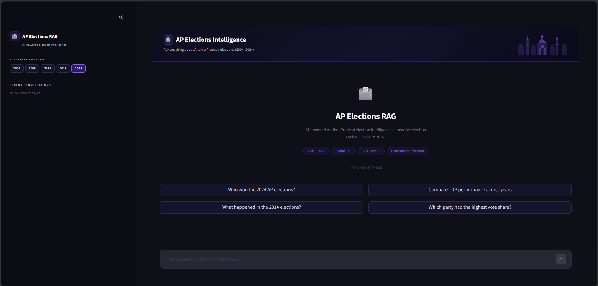
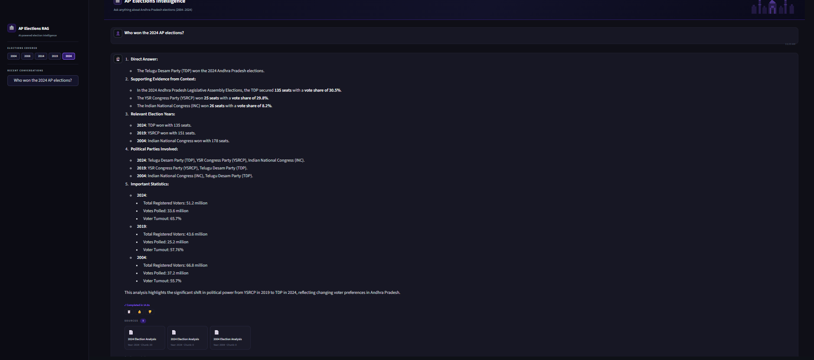
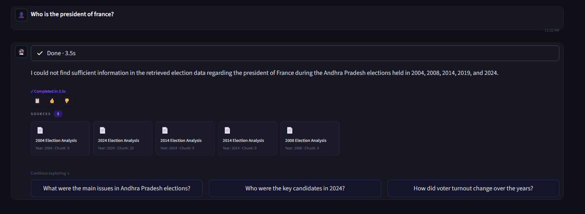

## 🗳️ AP Elections RAG Chatbot
An end-to-end Retrieval-Augmented Generation (RAG) application built using Andhra Pradesh election datasets from 2004–2024. The application allows users to ask natural language questions about Andhra Pradesh elections and receive grounded AI-generated answers with source references.

## 🚀 Features
- Hybrid Retrieval (Semantic Search + BM25)
- AI-generated grounded answers using GPT-4o-mini
- ChromaDB vector database for vector search
- Source-aware responses with citations
- Temporal query understanding (latest/recent election queries)
- Hallucination reduction using retrieval thresholding
- Metadata-aware retrieval and filtering
- Streamlit-based conversational UI
- Multi-election cycle support (2004–2024)

## 📊 Dataset Coverage
The project includes:
- Election results
- Party-wise performance
- Vote shares
- Seat distribution
- Election analysis documents
- Multi-year election comparisons

Covered election years:
- 2004, 2008, 2014, 2019, 2024

## 🧠 RAG Pipeline
```text
Election Documents
        ↓
Document Ingestion
        ↓
Recursive Chunking
        ↓
Embedding Generation
        ↓
ChromaDB Vector Store
        ↓
Hybrid Retrieval
(Semantic + BM25)
        ↓
Threshold Filtering
        ↓
Context Reranking
        ↓
GPT-4o-mini Grounded Generation
        ↓
Answer with Source Citations

📁 Project Structure
RAG_APELECTION_PROJECT/
│
├── data/                  # Election datasets
│   ├── 2004/
│   ├── 2008/
│   ├── 2014/
│   ├── 2019/
│   └── 2024/
│
├── db/                    # ChromaDB vector database
├── app.py                 # Streamlit application
├── rag.py                 # RAG pipeline logic
├── ingest.py              # Data ingestion pipeline
├── requirements.txt       # Dependencies
├── .env                   # API key
└── README.md              # Documentation

⚡ Installation
1. Clone Repository:
git clone <your-github-repo>
cd RAG_APELECTION_PROJECT

2. Create Virtual Environment(Windows):
python -m venv venv
venv\Scripts\activate

3. Install Dependencies
pip install -r requirements.txt

4. Setup API Key:
Create a .env file in the project root:
OPENAI_API_KEY=your_openai_api_key


5. Load Election Data
Run the ingestion pipeline:

python ingest.py

6. Run Application
streamlit run app.py

Application will open at:
http://localhost:8501

💡 Example Questions
Who won the 2024 AP elections?
Compare TDP performance from 2004 to 2024
What was the voter turnout in 2019?
Tell me about the 2014 bifurcation elections
Which party had the highest vote share?

🛡️ Hallucination Prevention
The system avoids generating unsupported answers by:

semantic retrieval
threshold filtering
grounded prompting


❗ Troubleshooting
ChromaDB Empty
Run:
python ingest.py

Streamlit Issues
Run:

streamlit run app.py --logger.level=error

# Application UI



# Sample Query



# Hallucination Prevention

